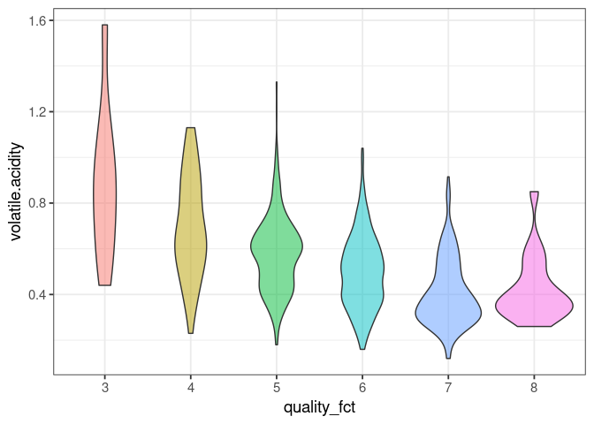

1_EDA
================

- <a href="#load-packages-and-data" id="toc-load-packages-and-data">Load
  packages and data</a>
- <a href="#summary-statistics" id="toc-summary-statistics">Summary
  Statistics</a>
- <a href="#correlations" id="toc-correlations">Correlations</a>
- <a href="#explore-some-features" id="toc-explore-some-features">Explore
  some features</a>
  - <a href="#wine-quality" id="toc-wine-quality">Wine Quality</a>
  - <a href="#number-of-special-requests"
    id="toc-number-of-special-requests">Number of special requests</a>
  - <a href="#number-of-adults" id="toc-number-of-adults">Number of
    adults</a>
- <a href="#dag" id="toc-dag">DAG</a>

# Load packages and data

``` r
library(tidyverse)
```

    ## ── Attaching packages ─────────────────────────────────────── tidyverse 1.3.2 ──
    ## ✔ ggplot2 3.4.1     ✔ purrr   1.0.1
    ## ✔ tibble  3.1.8     ✔ dplyr   1.1.0
    ## ✔ tidyr   1.3.0     ✔ stringr 1.5.0
    ## ✔ readr   2.1.4     ✔ forcats 1.0.0
    ## ── Conflicts ────────────────────────────────────────── tidyverse_conflicts() ──
    ## ✖ dplyr::filter() masks stats::filter()
    ## ✖ dplyr::lag()    masks stats::lag()

``` r
library(skimr)
library(corrplot)
```

    ## corrplot 0.92 loaded

``` r
library(dagitty)
df <- read.csv('winequality-red.csv')
glimpse(df)
```

    ## Rows: 1,599
    ## Columns: 12
    ## $ fixed.acidity        <dbl> 7.4, 7.8, 7.8, 11.2, 7.4, 7.4, 7.9, 7.3, 7.8, 7.5…
    ## $ volatile.acidity     <dbl> 0.700, 0.880, 0.760, 0.280, 0.700, 0.660, 0.600, …
    ## $ citric.acid          <dbl> 0.00, 0.00, 0.04, 0.56, 0.00, 0.00, 0.06, 0.00, 0…
    ## $ residual.sugar       <dbl> 1.9, 2.6, 2.3, 1.9, 1.9, 1.8, 1.6, 1.2, 2.0, 6.1,…
    ## $ chlorides            <dbl> 0.076, 0.098, 0.092, 0.075, 0.076, 0.075, 0.069, …
    ## $ free.sulfur.dioxide  <dbl> 11, 25, 15, 17, 11, 13, 15, 15, 9, 17, 15, 17, 16…
    ## $ total.sulfur.dioxide <dbl> 34, 67, 54, 60, 34, 40, 59, 21, 18, 102, 65, 102,…
    ## $ density              <dbl> 0.9978, 0.9968, 0.9970, 0.9980, 0.9978, 0.9978, 0…
    ## $ pH                   <dbl> 3.51, 3.20, 3.26, 3.16, 3.51, 3.51, 3.30, 3.39, 3…
    ## $ sulphates            <dbl> 0.56, 0.68, 0.65, 0.58, 0.56, 0.56, 0.46, 0.47, 0…
    ## $ alcohol              <dbl> 9.4, 9.8, 9.8, 9.8, 9.4, 9.4, 9.4, 10.0, 9.5, 10.…
    ## $ quality              <int> 5, 5, 5, 6, 5, 5, 5, 7, 7, 5, 5, 5, 5, 5, 5, 5, 7…

# Summary Statistics

``` r
df |> skim()
```

|                                                  |      |
|:-------------------------------------------------|:-----|
| Name                                             | df   |
| Number of rows                                   | 1599 |
| Number of columns                                | 12   |
| \_\_\_\_\_\_\_\_\_\_\_\_\_\_\_\_\_\_\_\_\_\_\_   |      |
| Column type frequency:                           |      |
| numeric                                          | 12   |
| \_\_\_\_\_\_\_\_\_\_\_\_\_\_\_\_\_\_\_\_\_\_\_\_ |      |
| Group variables                                  | None |

Data summary

**Variable type: numeric**

| skim_variable        | n_missing | complete_rate |  mean |    sd |   p0 |   p25 |   p50 |   p75 |   p100 | hist  |
|:---------------------|----------:|--------------:|------:|------:|-----:|------:|------:|------:|-------:|:------|
| fixed.acidity        |         0 |             1 |  8.32 |  1.74 | 4.60 |  7.10 |  7.90 |  9.20 |  15.90 | ▂▇▂▁▁ |
| volatile.acidity     |         0 |             1 |  0.53 |  0.18 | 0.12 |  0.39 |  0.52 |  0.64 |   1.58 | ▅▇▂▁▁ |
| citric.acid          |         0 |             1 |  0.27 |  0.19 | 0.00 |  0.09 |  0.26 |  0.42 |   1.00 | ▇▆▅▁▁ |
| residual.sugar       |         0 |             1 |  2.54 |  1.41 | 0.90 |  1.90 |  2.20 |  2.60 |  15.50 | ▇▁▁▁▁ |
| chlorides            |         0 |             1 |  0.09 |  0.05 | 0.01 |  0.07 |  0.08 |  0.09 |   0.61 | ▇▁▁▁▁ |
| free.sulfur.dioxide  |         0 |             1 | 15.87 | 10.46 | 1.00 |  7.00 | 14.00 | 21.00 |  72.00 | ▇▅▁▁▁ |
| total.sulfur.dioxide |         0 |             1 | 46.47 | 32.90 | 6.00 | 22.00 | 38.00 | 62.00 | 289.00 | ▇▂▁▁▁ |
| density              |         0 |             1 |  1.00 |  0.00 | 0.99 |  1.00 |  1.00 |  1.00 |   1.00 | ▁▃▇▂▁ |
| pH                   |         0 |             1 |  3.31 |  0.15 | 2.74 |  3.21 |  3.31 |  3.40 |   4.01 | ▁▅▇▂▁ |
| sulphates            |         0 |             1 |  0.66 |  0.17 | 0.33 |  0.55 |  0.62 |  0.73 |   2.00 | ▇▅▁▁▁ |
| alcohol              |         0 |             1 | 10.42 |  1.07 | 8.40 |  9.50 | 10.20 | 11.10 |  14.90 | ▇▇▃▁▁ |
| quality              |         0 |             1 |  5.64 |  0.81 | 3.00 |  5.00 |  6.00 |  6.00 |   8.00 | ▁▇▇▂▁ |

- Data set is already clean
- Features are all numeric

# Correlations

``` r
df |> select(where(is.numeric)) |> cor() |> 
  corrplot(method = "color", type = "upper", diag = FALSE, tl.cex = 0.8)
```

<!-- -->

- Alcohol and sulphates appear to positively correlate with the quality
- The volatile acidity seems to have a negative correlation

# Explore some features

## Wine Quality

``` r
ggplot(df, aes(x = quality)) +
  geom_histogram(bins = 6) +
theme_bw(base_size = 14)
```

<!-- -->

- Reservations shortly bookied before arrival are canceled a lot less

## Number of special requests

``` r
# ggplot(df, aes(x = no_of_special_requests, y = booking_status,  fill = booking_status)) +
#   geom_violin(alpha = 0.5) +
#   guides(fill="none") +
#   theme_bw(base_size = 14)
```

- Differences to the booking status depending on the special requests
- Not cancelled have more special requests

## Number of adults

``` r
# ggplot(df, aes(x = no_of_adults,  fill = market_segment_type)) + 
#   geom_histogram(bins = 5, position='dodge') +
#   theme_bw(base_size = 14)
```

- Most bookings are by two adults
- Online reservations are most frequent, followed by offline
- Corporate customers mostly come alone

# DAG

- Correlation does not equal causation
- Similarities are assumed here for ease of application

``` r
dag <- dagitty('
dag {
Lead_time -> Booking_status
No_of_special_requests -> Booking_status
No_of_adults -> Booking_status
No_of_adults -> No_of_special_requests
No_of_adults -> Lead_time
}
')
plot(graphLayout(dag))
```

<!-- -->
