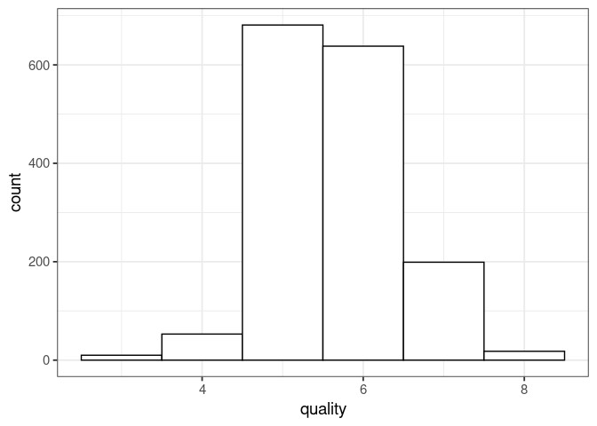
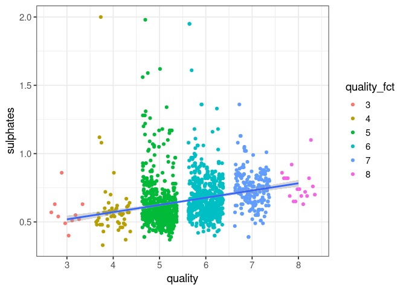

1_EDA
================

- <a href="#load-packages-and-data" id="toc-load-packages-and-data">Load
  packages and data</a>
- <a href="#summary-statistics" id="toc-summary-statistics">Summary
  Statistics</a>
- <a href="#change-feature-formats" id="toc-change-feature-formats">Change
  feature formats</a>
- <a href="#correlations" id="toc-correlations">Correlations</a>
- <a href="#explore-some-features" id="toc-explore-some-features">Explore
  some features</a>
  - <a href="#lead-time-and-booking-status"
    id="toc-lead-time-and-booking-status">Lead time and booking status</a>
  - <a href="#number-of-special-requests"
    id="toc-number-of-special-requests">Number of special requests</a>
  - <a href="#number-of-adults" id="toc-number-of-adults">Number of
    adults</a>

# Load packages and data

``` r
df <- read.csv('Hotel Reservations.csv')
glimpse(df)
```

    ## Rows: 36,275
    ## Columns: 19
    ## $ Booking_ID                           <chr> "INN00001", "INN00002", "INN00003…
    ## $ no_of_adults                         <int> 2, 2, 1, 2, 2, 2, 2, 2, 3, 2, 1, …
    ## $ no_of_children                       <int> 0, 0, 0, 0, 0, 0, 0, 0, 0, 0, 0, …
    ## $ no_of_weekend_nights                 <int> 1, 2, 2, 0, 1, 0, 1, 1, 0, 0, 1, …
    ## $ no_of_week_nights                    <int> 2, 3, 1, 2, 1, 2, 3, 3, 4, 5, 0, …
    ## $ type_of_meal_plan                    <chr> "Meal Plan 1", "Not Selected", "M…
    ## $ required_car_parking_space           <int> 0, 0, 0, 0, 0, 0, 0, 0, 0, 0, 0, …
    ## $ room_type_reserved                   <chr> "Room_Type 1", "Room_Type 1", "Ro…
    ## $ lead_time                            <int> 224, 5, 1, 211, 48, 346, 34, 83, …
    ## $ arrival_year                         <int> 2017, 2018, 2018, 2018, 2018, 201…
    ## $ arrival_month                        <int> 10, 11, 2, 5, 4, 9, 10, 12, 7, 10…
    ## $ arrival_date                         <int> 2, 6, 28, 20, 11, 13, 15, 26, 6, …
    ## $ market_segment_type                  <chr> "Offline", "Online", "Online", "O…
    ## $ repeated_guest                       <int> 0, 0, 0, 0, 0, 0, 0, 0, 0, 0, 0, …
    ## $ no_of_previous_cancellations         <int> 0, 0, 0, 0, 0, 0, 0, 0, 0, 0, 0, …
    ## $ no_of_previous_bookings_not_canceled <int> 0, 0, 0, 0, 0, 0, 0, 0, 0, 0, 0, …
    ## $ avg_price_per_room                   <dbl> 65.00, 106.68, 60.00, 100.00, 94.…
    ## $ no_of_special_requests               <int> 0, 1, 0, 0, 0, 1, 1, 1, 1, 3, 0, …
    ## $ booking_status                       <chr> "Not_Canceled", "Not_Canceled", "…

# Summary Statistics

``` r
df |> skim()
```

|                                                  |       |
|:-------------------------------------------------|:------|
| Name                                             | df    |
| Number of rows                                   | 36275 |
| Number of columns                                | 19    |
| \_\_\_\_\_\_\_\_\_\_\_\_\_\_\_\_\_\_\_\_\_\_\_   |       |
| Column type frequency:                           |       |
| character                                        | 5     |
| numeric                                          | 14    |
| \_\_\_\_\_\_\_\_\_\_\_\_\_\_\_\_\_\_\_\_\_\_\_\_ |       |
| Group variables                                  | None  |

Data summary

**Variable type: character**

| skim_variable       | n_missing | complete_rate | min | max | empty | n_unique | whitespace |
|:--------------------|----------:|--------------:|----:|----:|------:|---------:|-----------:|
| Booking_ID          |         0 |             1 |   8 |   8 |     0 |    36275 |          0 |
| type_of_meal_plan   |         0 |             1 |  11 |  12 |     0 |        4 |          0 |
| room_type_reserved  |         0 |             1 |  11 |  11 |     0 |        7 |          0 |
| market_segment_type |         0 |             1 |   6 |  13 |     0 |        5 |          0 |
| booking_status      |         0 |             1 |   8 |  12 |     0 |        2 |          0 |

**Variable type: numeric**

| skim_variable                        | n_missing | complete_rate |    mean |    sd |   p0 |    p25 |     p50 |  p75 | p100 | hist  |
|:-------------------------------------|----------:|--------------:|--------:|------:|-----:|-------:|--------:|-----:|-----:|:------|
| no_of_adults                         |         0 |             1 |    1.84 |  0.52 |    0 |    2.0 |    2.00 |    2 |    4 | ▁▂▇▁▁ |
| no_of_children                       |         0 |             1 |    0.11 |  0.40 |    0 |    0.0 |    0.00 |    0 |   10 | ▇▁▁▁▁ |
| no_of_weekend_nights                 |         0 |             1 |    0.81 |  0.87 |    0 |    0.0 |    1.00 |    2 |    7 | ▇▃▁▁▁ |
| no_of_week_nights                    |         0 |             1 |    2.20 |  1.41 |    0 |    1.0 |    2.00 |    3 |   17 | ▇▁▁▁▁ |
| required_car_parking_space           |         0 |             1 |    0.03 |  0.17 |    0 |    0.0 |    0.00 |    0 |    1 | ▇▁▁▁▁ |
| lead_time                            |         0 |             1 |   85.23 | 85.93 |    0 |   17.0 |   57.00 |  126 |  443 | ▇▃▁▁▁ |
| arrival_year                         |         0 |             1 | 2017.82 |  0.38 | 2017 | 2018.0 | 2018.00 | 2018 | 2018 | ▂▁▁▁▇ |
| arrival_month                        |         0 |             1 |    7.42 |  3.07 |    1 |    5.0 |    8.00 |   10 |   12 | ▃▃▅▆▇ |
| arrival_date                         |         0 |             1 |   15.60 |  8.74 |    1 |    8.0 |   16.00 |   23 |   31 | ▇▇▇▆▆ |
| repeated_guest                       |         0 |             1 |    0.03 |  0.16 |    0 |    0.0 |    0.00 |    0 |    1 | ▇▁▁▁▁ |
| no_of_previous_cancellations         |         0 |             1 |    0.02 |  0.37 |    0 |    0.0 |    0.00 |    0 |   13 | ▇▁▁▁▁ |
| no_of_previous_bookings_not_canceled |         0 |             1 |    0.15 |  1.75 |    0 |    0.0 |    0.00 |    0 |   58 | ▇▁▁▁▁ |
| avg_price_per_room                   |         0 |             1 |  103.42 | 35.09 |    0 |   80.3 |   99.45 |  120 |  540 | ▇▅▁▁▁ |
| no_of_special_requests               |         0 |             1 |    0.62 |  0.79 |    0 |    0.0 |    0.00 |    1 |    5 | ▇▁▁▁▁ |

- Data set is already clean
- The 4 categorical features are transformed to factor variables next

# Change feature formats

``` r
df$type_of_meal_plan <- factor(df$type_of_meal_plan)
df$room_type_reserved <- factor(df$room_type_reserved)
df$market_segment_type <- factor(df$market_segment_type)
df$booking_status <- factor(df$booking_status)
df$booking_canceled <- ifelse(df$booking_status == 'Canceled', 1, 0)
```

# Correlations

``` r
df |> select(where(is.numeric)) |> cor() |> 
  corrplot(method = "color", type = "upper", diag = FALSE, tl.cex = 0.8)
```

<!-- -->

- The lead time seems to positively affect whether a booking is canceled
- The number of special requests seems to have a negative influence

# Explore some features

## Lead time and booking status

``` r
ggplot(df, aes(x = lead_time, fill = booking_status)) +
  geom_density(alpha = 0.5) +
  theme_bw(base_size = 14)
```

<!-- -->

- Reservations shortly bookied before arrival are canceled a lot less

## Number of special requests

``` r
ggplot(df, aes(x = no_of_special_requests, y = booking_status,  fill = booking_status)) +
  geom_violin(alpha = 0.5) +
  guides(fill="none") +
  theme_bw(base_size = 14)
```

<!-- -->

- Differences to the booking status depending on the special requests
- Not cancelled have more special requests

## Number of adults

``` r
ggplot(df, aes(x = no_of_adults,  fill = market_segment_type)) + 
  geom_histogram(bins = 5, position='dodge') +
  theme_bw(base_size = 14)
```

<!-- -->

- Most bookings are by two adults
- Online reservations are most frequent, followed by offline
- Corporate customers mostly come alone
