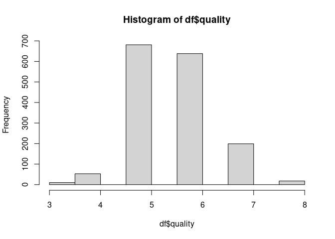

3 Check OLS Assumptions
================

- <a href="#load-packages-and-data" id="toc-load-packages-and-data">Load
  packages and data</a>
- <a href="#recreate-model" id="toc-recreate-model">Recreate Model</a>
- <a href="#check-model-assumptions"
  id="toc-check-model-assumptions">Check Model Assumptions</a>
  - <a href="#check-normality" id="toc-check-normality">Check Normality</a>
  - <a href="#check-heteroskedasticity"
    id="toc-check-heteroskedasticity">Check Heteroskedasticity</a>
  - <a href="#test-simpler-model" id="toc-test-simpler-model">Test simpler
    model</a>
  - <a href="#check-multicollinearity"
    id="toc-check-multicollinearity">Check Multicollinearity</a>

# Load packages and data

``` r
library(tidyverse)
```

    ## ── Attaching packages ─────────────────────────────────────── tidyverse 1.3.2 ──
    ## ✔ ggplot2 3.4.1     ✔ purrr   1.0.1
    ## ✔ tibble  3.1.8     ✔ dplyr   1.1.0
    ## ✔ tidyr   1.3.0     ✔ stringr 1.5.0
    ## ✔ readr   2.1.4     ✔ forcats 1.0.0
    ## ── Conflicts ────────────────────────────────────────── tidyverse_conflicts() ──
    ## ✖ dplyr::filter() masks stats::filter()
    ## ✖ dplyr::lag()    masks stats::lag()

``` r
library(stargazer)
```

    ## 
    ## Please cite as: 
    ## 
    ##  Hlavac, Marek (2022). stargazer: Well-Formatted Regression and Summary Statistics Tables.
    ##  R package version 5.2.3. https://CRAN.R-project.org/package=stargazer

``` r
library(AER)
```

    ## Loading required package: car
    ## Loading required package: carData
    ## 
    ## Attaching package: 'car'
    ## 
    ## The following object is masked from 'package:dplyr':
    ## 
    ##     recode
    ## 
    ## The following object is masked from 'package:purrr':
    ## 
    ##     some
    ## 
    ## Loading required package: lmtest
    ## Loading required package: zoo
    ## 
    ## Attaching package: 'zoo'
    ## 
    ## The following objects are masked from 'package:base':
    ## 
    ##     as.Date, as.Date.numeric
    ## 
    ## Loading required package: sandwich
    ## Loading required package: survival

``` r
df <- read.csv('winequality-red.csv')
glimpse(df)
```

    ## Rows: 1,599
    ## Columns: 12
    ## $ fixed.acidity        <dbl> 7.4, 7.8, 7.8, 11.2, 7.4, 7.4, 7.9, 7.3, 7.8, 7.5…
    ## $ volatile.acidity     <dbl> 0.700, 0.880, 0.760, 0.280, 0.700, 0.660, 0.600, …
    ## $ citric.acid          <dbl> 0.00, 0.00, 0.04, 0.56, 0.00, 0.00, 0.06, 0.00, 0…
    ## $ residual.sugar       <dbl> 1.9, 2.6, 2.3, 1.9, 1.9, 1.8, 1.6, 1.2, 2.0, 6.1,…
    ## $ chlorides            <dbl> 0.076, 0.098, 0.092, 0.075, 0.076, 0.075, 0.069, …
    ## $ free.sulfur.dioxide  <dbl> 11, 25, 15, 17, 11, 13, 15, 15, 9, 17, 15, 17, 16…
    ## $ total.sulfur.dioxide <dbl> 34, 67, 54, 60, 34, 40, 59, 21, 18, 102, 65, 102,…
    ## $ density              <dbl> 0.9978, 0.9968, 0.9970, 0.9980, 0.9978, 0.9978, 0…
    ## $ pH                   <dbl> 3.51, 3.20, 3.26, 3.16, 3.51, 3.51, 3.30, 3.39, 3…
    ## $ sulphates            <dbl> 0.56, 0.68, 0.65, 0.58, 0.56, 0.56, 0.46, 0.47, 0…
    ## $ alcohol              <dbl> 9.4, 9.8, 9.8, 9.8, 9.4, 9.4, 9.4, 10.0, 9.5, 10.…
    ## $ quality              <int> 5, 5, 5, 6, 5, 5, 5, 7, 7, 5, 5, 5, 5, 5, 5, 5, 7…

# Recreate Model

``` r
model2 <- lm(quality ~ alcohol + sulphates + citric.acid + volatile.acidity + 
  sulphates*citric.acid + citric.acid*alcohol + citric.acid*volatile.acidity
  , data=df)
stargazer(model2, intercept.bottom=FALSE, type="text")
```

    ## 
    ## ========================================================
    ##                                  Dependent variable:    
    ##                              ---------------------------
    ##                                        quality          
    ## --------------------------------------------------------
    ## Constant                              2.919***          
    ##                                        (0.331)          
    ##                                                         
    ## alcohol                               0.251***          
    ##                                        (0.027)          
    ##                                                         
    ## sulphates                             1.193***          
    ##                                        (0.192)          
    ##                                                         
    ## citric.acid                            -1.283           
    ##                                        (0.965)          
    ##                                                         
    ## volatile.acidity                      -1.235***         
    ##                                        (0.177)          
    ##                                                         
    ## sulphates:citric.acid                 -1.324***         
    ##                                        (0.457)          
    ##                                                         
    ## alcohol:citric.acid                    0.194**          
    ##                                        (0.076)          
    ##                                                         
    ## citric.acid:volatile.acidity            0.100           
    ##                                        (0.551)          
    ##                                                         
    ## --------------------------------------------------------
    ## Observations                            1,599           
    ## R2                                      0.343           
    ## Adjusted R2                             0.340           
    ## Residual Std. Error               0.656 (df = 1591)     
    ## F Statistic                   118.508*** (df = 7; 1591) 
    ## ========================================================
    ## Note:                        *p<0.1; **p<0.05; ***p<0.01

# Check Model Assumptions

## Check Normality

``` r
hist(df$quality)
```

<!-- -->

``` r
shapiro.test(df$quality)
```

    ## 
    ##  Shapiro-Wilk normality test
    ## 
    ## data:  df$quality
    ## W = 0.85759, p-value < 2.2e-16

- Shapiro test: Null hypothesis has to be rejected -\> Not normally
  distributed
- Quality does not seem to follow a normal distribution
- Visual impression does not seem too far off

### trying to restore normality

``` r
shapiro.test(log(df$quality))
```

    ## 
    ##  Shapiro-Wilk normality test
    ## 
    ## data:  log(df$quality)
    ## W = 0.84894, p-value < 2.2e-16

``` r
shapiro.test((df$quality)^(1/2))
```

    ## 
    ##  Shapiro-Wilk normality test
    ## 
    ## data:  (df$quality)^(1/2)
    ## W = 0.85666, p-value < 2.2e-16

``` r
shapiro.test(1/(df$quality))
```

    ## 
    ##  Shapiro-Wilk normality test
    ## 
    ## data:  1/(df$quality)
    ## W = 0.80744, p-value < 2.2e-16

- Transforming quality by log, square root or inverse does not restore
  normality

## Check Heteroskedasticity

``` r
par(mfrow=c(2,2))
plot(model2)
```

<!-- -->

``` r
bptest(model2)
```

    ## 
    ##  studentized Breusch-Pagan test
    ## 
    ## data:  model2
    ## BP = 53.96, df = 7, p-value = 2.395e-09

- QQ Plot hints toward heteroskedasticity
- Breusch-Pagan test: Null hypothesis has to be rejected -\>
  Heteroskedastic
- Use robust standard errors to not make biased interpretations of
  variable significance

``` r
seBasic <- sqrt(diag(vcov(model2)))
seWhite <- sqrt(diag(vcovHC(model2, type="HC0")))

stargazer(model2, model2,  se=list(seBasic, seWhite), intercept.bottom=FALSE, type="text")
```

    ## 
    ## ============================================================
    ##                                     Dependent variable:     
    ##                                 ----------------------------
    ##                                           quality           
    ##                                      (1)            (2)     
    ## ------------------------------------------------------------
    ## Constant                           2.919***      2.919***   
    ##                                    (0.331)        (0.383)   
    ##                                                             
    ## alcohol                            0.251***      0.251***   
    ##                                    (0.027)        (0.032)   
    ##                                                             
    ## sulphates                          1.193***      1.193***   
    ##                                    (0.192)        (0.230)   
    ##                                                             
    ## citric.acid                         -1.283        -1.283    
    ##                                    (0.965)        (1.251)   
    ##                                                             
    ## volatile.acidity                  -1.235***      -1.235***  
    ##                                    (0.177)        (0.224)   
    ##                                                             
    ## sulphates:citric.acid             -1.324***      -1.324**   
    ##                                    (0.457)        (0.548)   
    ##                                                             
    ## alcohol:citric.acid                0.194**        0.194*    
    ##                                    (0.076)        (0.100)   
    ##                                                             
    ## citric.acid:volatile.acidity        0.100          0.100    
    ##                                    (0.551)        (0.665)   
    ##                                                             
    ## ------------------------------------------------------------
    ## Observations                        1,599          1,599    
    ## R2                                  0.343          0.343    
    ## Adjusted R2                         0.340          0.340    
    ## Residual Std. Error (df = 1591)     0.656          0.656    
    ## F Statistic (df = 7; 1591)        118.508***    118.508***  
    ## ============================================================
    ## Note:                            *p<0.1; **p<0.05; ***p<0.01

- Using White robust standard errors lowers significance of citric.acid
  interactions -\> citric acid could potentially be excluded from the
  model, in case not much explanatory power is lost

## Test simpler model

``` r
model3 <- lm(quality ~ alcohol + sulphates +  volatile.acidity, data=df)
seWhite <- sqrt(diag(vcovHC(model3, type="HC0")))
stargazer(model3, se=list(seWhite), intercept.bottom=FALSE, type="text")
```

    ## 
    ## ===============================================
    ##                         Dependent variable:    
    ##                     ---------------------------
    ##                               quality          
    ## -----------------------------------------------
    ## Constant                     2.611***          
    ##                               (0.217)          
    ##                                                
    ## alcohol                      0.309***          
    ##                               (0.018)          
    ##                                                
    ## sulphates                    0.679***          
    ##                               (0.126)          
    ##                                                
    ## volatile.acidity             -1.221***         
    ##                               (0.111)          
    ##                                                
    ## -----------------------------------------------
    ## Observations                   1,599           
    ## R2                             0.336           
    ## Adjusted R2                    0.335           
    ## Residual Std. Error      0.659 (df = 1595)     
    ## F Statistic          268.912*** (df = 3; 1595) 
    ## ===============================================
    ## Note:               *p<0.1; **p<0.05; ***p<0.01

- Model barely loses R², but becomes much more simple
- Additionally, all parameters are now highly significant

## Check Multicollinearity

``` r
# Variance Inflation Factors
vif(mod=model3)
```

    ##          alcohol        sulphates volatile.acidity 
    ##         1.044612         1.075095         1.111146

``` r
# Tolerances
1 / vif(mod=model3)
```

    ##          alcohol        sulphates volatile.acidity 
    ##        0.9572932        0.9301503        0.8999718

- Variance Inflation Factors are below 4 and Tolerances are above 0.25
  -\> Points toward absence of multicollinearity
