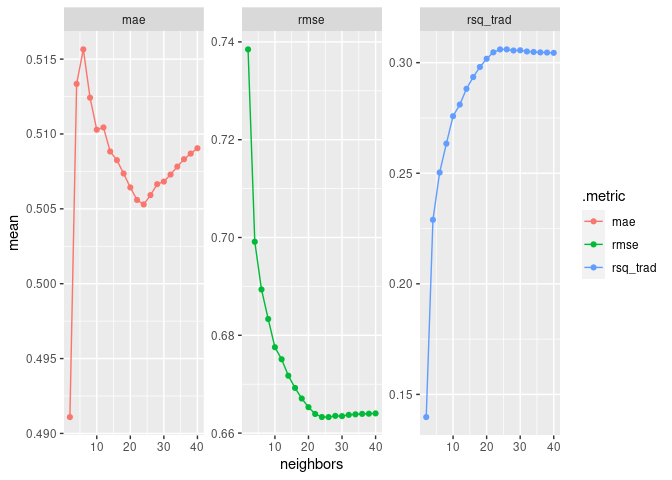

4 OLS and kNN Regression
================

- <a href="#load-packages-and-data" id="toc-load-packages-and-data">Load
  packages and data</a>
- <a href="#create-train-validation-and-test-split"
  id="toc-create-train-validation-and-test-split">Create train, validation
  and test split</a>
- <a href="#linear-regression-model"
  id="toc-linear-regression-model">Linear Regression Model</a>
  - <a href="#set-model-and-workflow" id="toc-set-model-and-workflow">Set
    model and workflow</a>
- <a href="#k-nearest-neighbours-model"
  id="toc-k-nearest-neighbours-model">K-Nearest Neighbours Model</a>
  - <a href="#set-model-and-workflow-1"
    id="toc-set-model-and-workflow-1">Set model and workflow</a>
  - <a href="#tune-model" id="toc-tune-model">Tune model</a>
  - <a href="#evaluation-of-tuning-results"
    id="toc-evaluation-of-tuning-results">Evaluation of tuning results</a>
- <a href="#compare-model-performances"
  id="toc-compare-model-performances">Compare model performances</a>

# Load packages and data

``` r
library(tidymodels)
```

    ## ── Attaching packages ────────────────────────────────────── tidymodels 1.0.0 ──

    ## ✔ broom        1.0.3     ✔ recipes      1.0.4
    ## ✔ dials        1.1.0     ✔ rsample      1.1.1
    ## ✔ dplyr        1.1.0     ✔ tibble       3.1.8
    ## ✔ ggplot2      3.4.1     ✔ tidyr        1.3.0
    ## ✔ infer        1.0.4     ✔ tune         1.0.1
    ## ✔ modeldata    1.1.0     ✔ workflows    1.1.2
    ## ✔ parsnip      1.0.3     ✔ workflowsets 1.0.0
    ## ✔ purrr        1.0.1     ✔ yardstick    1.1.0

    ## ── Conflicts ───────────────────────────────────────── tidymodels_conflicts() ──
    ## ✖ purrr::discard() masks scales::discard()
    ## ✖ dplyr::filter()  masks stats::filter()
    ## ✖ dplyr::lag()     masks stats::lag()
    ## ✖ recipes::step()  masks stats::step()
    ## • Use tidymodels_prefer() to resolve common conflicts.

``` r
df <- read.csv('winequality-red.csv')
glimpse(df)
```

    ## Rows: 1,599
    ## Columns: 12
    ## $ fixed.acidity        <dbl> 7.4, 7.8, 7.8, 11.2, 7.4, 7.4, 7.9, 7.3, 7.8, 7.5…
    ## $ volatile.acidity     <dbl> 0.700, 0.880, 0.760, 0.280, 0.700, 0.660, 0.600, …
    ## $ citric.acid          <dbl> 0.00, 0.00, 0.04, 0.56, 0.00, 0.00, 0.06, 0.00, 0…
    ## $ residual.sugar       <dbl> 1.9, 2.6, 2.3, 1.9, 1.9, 1.8, 1.6, 1.2, 2.0, 6.1,…
    ## $ chlorides            <dbl> 0.076, 0.098, 0.092, 0.075, 0.076, 0.075, 0.069, …
    ## $ free.sulfur.dioxide  <dbl> 11, 25, 15, 17, 11, 13, 15, 15, 9, 17, 15, 17, 16…
    ## $ total.sulfur.dioxide <dbl> 34, 67, 54, 60, 34, 40, 59, 21, 18, 102, 65, 102,…
    ## $ density              <dbl> 0.9978, 0.9968, 0.9970, 0.9980, 0.9978, 0.9978, 0…
    ## $ pH                   <dbl> 3.51, 3.20, 3.26, 3.16, 3.51, 3.51, 3.30, 3.39, 3…
    ## $ sulphates            <dbl> 0.56, 0.68, 0.65, 0.58, 0.56, 0.56, 0.46, 0.47, 0…
    ## $ alcohol              <dbl> 9.4, 9.8, 9.8, 9.8, 9.4, 9.4, 9.4, 10.0, 9.5, 10.…
    ## $ quality              <int> 5, 5, 5, 6, 5, 5, 5, 7, 7, 5, 5, 5, 5, 5, 5, 5, 7…

# Create train, validation and test split

``` r
set.seed(1)
wine_split <- initial_split(df, prop = 0.7)
wine_split
```

    ## <Training/Testing/Total>
    ## <1119/480/1599>

``` r
wine_train <- training(wine_split)
wine_train_val <- validation_split(wine_train, prop = 0.7)
wine_test  <- testing(wine_split)
```

- Data set is split into 70% training data and 30% test data
- Out of the 70% training data, 70% are used for model training and 30 %
  for parameter evaluation

# Linear Regression Model

## Set model and workflow

``` r
linear_model <- linear_reg() |> set_engine("lm")
linear_model_recipe <- recipe(quality ~ alcohol + sulphates + volatile.acidity,
  data = wine_train)
linear_model_workflow <- workflow() |> add_model(linear_model) |> 
  add_recipe(linear_model_recipe)
linear_model_workflow
```

    ## ══ Workflow ════════════════════════════════════════════════════════════════════
    ## Preprocessor: Recipe
    ## Model: linear_reg()
    ## 
    ## ── Preprocessor ────────────────────────────────────────────────────────────────
    ## 0 Recipe Steps
    ## 
    ## ── Model ───────────────────────────────────────────────────────────────────────
    ## Linear Regression Model Specification (regression)
    ## 
    ## Computational engine: lm

- Linear regression model is defined and combined into a workflow

# K-Nearest Neighbours Model

## Set model and workflow

``` r
knn_model <- nearest_neighbor(neighbors = tune()) |> 
  set_mode("regression") |> set_engine("kknn")
knn_recipe <- recipe(quality ~ alcohol + sulphates + volatile.acidity,
  data = wine_train) |> step_normalize(all_predictors())
knn_workflow <- workflow() |> add_model(knn_model) |> 
  add_recipe(knn_recipe)
knn_workflow
```

    ## ══ Workflow ════════════════════════════════════════════════════════════════════
    ## Preprocessor: Recipe
    ## Model: nearest_neighbor()
    ## 
    ## ── Preprocessor ────────────────────────────────────────────────────────────────
    ## 1 Recipe Step
    ## 
    ## • step_normalize()
    ## 
    ## ── Model ───────────────────────────────────────────────────────────────────────
    ## K-Nearest Neighbor Model Specification (regression)
    ## 
    ## Main Arguments:
    ##   neighbors = tune()
    ## 
    ## Computational engine: kknn

- K-nearest neighbor model is defined and combined into a workflow
- Variables are normalized to not bias distance calculations of the
  model
- The model parameter K will be tuned on the validation set

## Tune model

``` r
tune_grid <- tibble(neighbors = 1:20*2)
knn_tune <- knn_workflow |> tune_grid(resamples = wine_train_val, 
    grid = tune_grid, metrics = metric_set(rmse, mae, rsq_trad))
knn_tune_metrics <- knn_tune |> collect_metrics()
```

- Tune grid is defined as 2-40 in steps of 2
- Grid search is performed to evaluate model performance with different
  hyper parameters

## Evaluation of tuning results

``` r
knn_tune_metrics |> 
  ggplot(aes(x = neighbors, y = mean, colour = .metric)) + geom_point() + 
  geom_line() + facet_wrap(~ .metric, scales = "free_y")
```

<!-- -->

``` r
knn_tune |> show_best("rmse", n = 5) 
```

    ## # A tibble: 5 × 7
    ##   neighbors .metric .estimator  mean     n std_err .config              
    ##       <dbl> <chr>   <chr>      <dbl> <int>   <dbl> <chr>                
    ## 1        26 rmse    standard   0.663     1      NA Preprocessor1_Model13
    ## 2        24 rmse    standard   0.663     1      NA Preprocessor1_Model12
    ## 3        30 rmse    standard   0.663     1      NA Preprocessor1_Model15
    ## 4        28 rmse    standard   0.664     1      NA Preprocessor1_Model14
    ## 5        32 rmse    standard   0.664     1      NA Preprocessor1_Model16

``` r
knn_best_model <- select_best(knn_tune, metric = "rmse")
knn_workflow_final <- knn_workflow |> 
  finalize_workflow(knn_best_model)
```

- Model performance is evaluated on the mean absolute error, the root
  mean squared error and R²
- Best RMSE performance can be achieved at k=26
- Best tuning parameter is included into the workflow

# Compare model performances

``` r
linear_model_last_fit <- linear_model_workflow |> 
  last_fit(wine_split, metrics = metric_set(rmse, mae, rsq_trad))
linear_model_metrics <- linear_model_last_fit |> collect_metrics()

knn_last_fit <- knn_workflow_final |> 
  last_fit(wine_split, metrics = metric_set(rmse, mae, rsq_trad))
knn_metrics <- knn_last_fit |> collect_metrics()

linear_model_metrics <- linear_model_metrics |> select(-.estimator, -.config) |> 
  mutate(model = "linear regression")
knn_metrics <- knn_metrics |> select(-.estimator, -.config) |> 
  mutate(model = "k-nearest neighbors")
linear_model_metrics |> bind_rows(knn_metrics) |> 
  pivot_wider(names_from = .metric, values_from = .estimate)
```

    ## # A tibble: 2 × 4
    ##   model                rmse   mae rsq_trad
    ##   <chr>               <dbl> <dbl>    <dbl>
    ## 1 linear regression   0.674 0.528    0.332
    ## 2 k-nearest neighbors 0.659 0.521    0.362

- Models are applied to test data and resulting performances are
  compared
- K-nearest neighbors is the better model
  - Lower errors of predictions
  - It can explain more variation of the dependent variable
