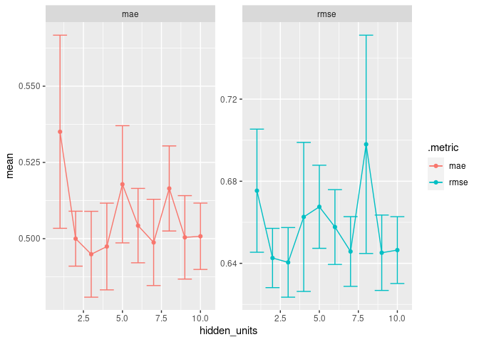
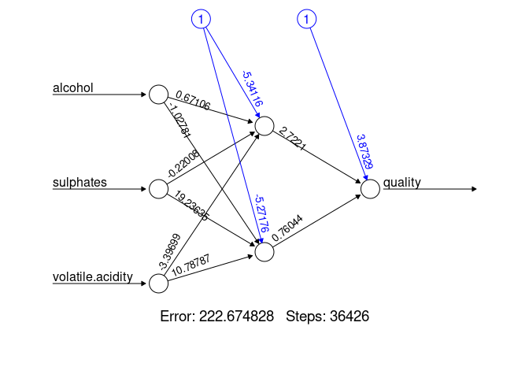

5 Neural Network Prediction
================

- <a href="#load-packages-and-data" id="toc-load-packages-and-data">Load
  packages and data</a>
- <a href="#create-train-split-test-split-and-cross-validation"
  id="toc-create-train-split-test-split-and-cross-validation">Create train
  split, test split and cross validation</a>
- <a href="#neural-network" id="toc-neural-network">Neural Network</a>
  - <a href="#set-model-and-workflow" id="toc-set-model-and-workflow">Set
    model and workflow</a>
  - <a href="#tune-model" id="toc-tune-model">Tune model</a>
  - <a href="#evaluation-of-tuning-results"
    id="toc-evaluation-of-tuning-results">Evaluation of tuning results</a>
- <a href="#visualize-final-model"
  id="toc-visualize-final-model">Visualize final model</a>
- <a href="#determine-model-performance"
  id="toc-determine-model-performance">Determine model performance</a>

# Load packages and data

``` r
library(tidymodels)
```

    ## ── Attaching packages ────────────────────────────────────── tidymodels 1.0.0 ──

    ## ✔ broom        1.0.3     ✔ recipes      1.0.4
    ## ✔ dials        1.1.0     ✔ rsample      1.1.1
    ## ✔ dplyr        1.1.0     ✔ tibble       3.1.8
    ## ✔ ggplot2      3.4.1     ✔ tidyr        1.3.0
    ## ✔ infer        1.0.4     ✔ tune         1.0.1
    ## ✔ modeldata    1.1.0     ✔ workflows    1.1.2
    ## ✔ parsnip      1.0.3     ✔ workflowsets 1.0.0
    ## ✔ purrr        1.0.1     ✔ yardstick    1.1.0

    ## ── Conflicts ───────────────────────────────────────── tidymodels_conflicts() ──
    ## ✖ purrr::discard() masks scales::discard()
    ## ✖ dplyr::filter()  masks stats::filter()
    ## ✖ dplyr::lag()     masks stats::lag()
    ## ✖ recipes::step()  masks stats::step()
    ## • Use tidymodels_prefer() to resolve common conflicts.

``` r
library(neuralnet)
```

    ## 
    ## Attaching package: 'neuralnet'

    ## The following object is masked from 'package:dplyr':
    ## 
    ##     compute

``` r
library(doParallel)
```

    ## Loading required package: foreach

    ## 
    ## Attaching package: 'foreach'

    ## The following objects are masked from 'package:purrr':
    ## 
    ##     accumulate, when

    ## Loading required package: iterators

    ## Loading required package: parallel

``` r
df <- read.csv('~/Red_Wine_Quality/winequality-red.csv')
glimpse(df)
```

    ## Rows: 1,599
    ## Columns: 12
    ## $ fixed.acidity        <dbl> 7.4, 7.8, 7.8, 11.2, 7.4, 7.4, 7.9, 7.3, 7.8, 7.5…
    ## $ volatile.acidity     <dbl> 0.700, 0.880, 0.760, 0.280, 0.700, 0.660, 0.600, …
    ## $ citric.acid          <dbl> 0.00, 0.00, 0.04, 0.56, 0.00, 0.00, 0.06, 0.00, 0…
    ## $ residual.sugar       <dbl> 1.9, 2.6, 2.3, 1.9, 1.9, 1.8, 1.6, 1.2, 2.0, 6.1,…
    ## $ chlorides            <dbl> 0.076, 0.098, 0.092, 0.075, 0.076, 0.075, 0.069, …
    ## $ free.sulfur.dioxide  <dbl> 11, 25, 15, 17, 11, 13, 15, 15, 9, 17, 15, 17, 16…
    ## $ total.sulfur.dioxide <dbl> 34, 67, 54, 60, 34, 40, 59, 21, 18, 102, 65, 102,…
    ## $ density              <dbl> 0.9978, 0.9968, 0.9970, 0.9980, 0.9978, 0.9978, 0…
    ## $ pH                   <dbl> 3.51, 3.20, 3.26, 3.16, 3.51, 3.51, 3.30, 3.39, 3…
    ## $ sulphates            <dbl> 0.56, 0.68, 0.65, 0.58, 0.56, 0.56, 0.46, 0.47, 0…
    ## $ alcohol              <dbl> 9.4, 9.8, 9.8, 9.8, 9.4, 9.4, 9.4, 10.0, 9.5, 10.…
    ## $ quality              <int> 5, 5, 5, 6, 5, 5, 5, 7, 7, 5, 5, 5, 5, 5, 5, 5, 7…

# Create train split, test split and cross validation

``` r
set.seed(1)
wine_split <- initial_split(df, prop = 0.7)
wine_split
```

    ## <Training/Testing/Total>
    ## <1119/480/1599>

``` r
wine_train <- training(wine_split)
wine_test  <- testing(wine_split)

cv_folds <- wine_train |> vfold_cv(v = 5)
```

- Data set is split into 70% training data and 30% test data
- Training data is divided into 3-fold cross validation

# Neural Network

## Set model and workflow

``` r
neural_network <- mlp(hidden_units = tune()) |>  
  set_engine("nnet") |> set_mode("regression")
neural_network_recipe <- recipe(quality ~ alcohol + sulphates + volatile.acidity,
  data = wine_train) |>  step_normalize(all_predictors())
neural_network_workflow <- workflow() |>  add_recipe(neural_network_recipe) |>  
  add_model(neural_network)
```

- Neural net model is defined and combined into a workflow
- Variables are normalized to not bias distance calculations of the
  model
- The number of hidden units will be tuned with cross validation

## Tune model

``` r
tune_grid <- tibble(hidden_units = 1:10)
registerDoParallel()
neural_net_tune <- tune_grid(neural_network_workflow, resamples = cv_folds,
  grid = tune_grid, metrics = metric_set(rmse, mae))
```

- Tune grid is defined as 1-10 hidden units in the first layer
- Grid search is performed to evaluate model performance with different
  hyper parameters

## Evaluation of tuning results

``` r
neural_net_tune %>% collect_metrics() %>%
  ggplot(aes(x = hidden_units, y = mean, ymin = mean - std_err, ymax = mean + std_err, 
             colour = .metric)) +
  geom_errorbar() + geom_line() + geom_point() +
  facet_wrap(~ .metric, scales = "free_y")
```

<!-- -->

``` r
neural_net_tune |> show_best("rmse", n = 5) 
```

    ## # A tibble: 5 × 7
    ##   hidden_units .metric .estimator  mean     n std_err .config              
    ##          <int> <chr>   <chr>      <dbl> <int>   <dbl> <chr>                
    ## 1            3 rmse    standard   0.640     5  0.0170 Preprocessor1_Model03
    ## 2            2 rmse    standard   0.643     5  0.0144 Preprocessor1_Model02
    ## 3            9 rmse    standard   0.645     5  0.0184 Preprocessor1_Model09
    ## 4            7 rmse    standard   0.646     5  0.0170 Preprocessor1_Model07
    ## 5           10 rmse    standard   0.646     5  0.0163 Preprocessor1_Model10

``` r
neural_net_selected <- select_by_one_std_err(neural_net_tune, metric = "rmse", hidden_units)
neural_net_selected
```

    ## # A tibble: 1 × 9
    ##   hidden_units .metric .estimator  mean     n std_err .config       .best .bound
    ##          <int> <chr>   <chr>      <dbl> <int>   <dbl> <chr>         <dbl>  <dbl>
    ## 1            2 rmse    standard   0.643     5  0.0144 Preprocessor… 0.640  0.657

``` r
neural_net_workflow_final <- finalize_workflow(neural_network_workflow, neural_net_selected)
neural_net_workflow_final
```

    ## ══ Workflow ════════════════════════════════════════════════════════════════════
    ## Preprocessor: Recipe
    ## Model: mlp()
    ## 
    ## ── Preprocessor ────────────────────────────────────────────────────────────────
    ## 1 Recipe Step
    ## 
    ## • step_normalize()
    ## 
    ## ── Model ───────────────────────────────────────────────────────────────────────
    ## Single Layer Neural Network Model Specification (regression)
    ## 
    ## Main Arguments:
    ##   hidden_units = 2
    ## 
    ## Computational engine: nnet

- Adding a second hidden unit provides biggest improvement
- Parameter is chosen according to one-standard-error rule, to keep the
  model simple
- Two hidden units are selected to finalize the workflow

# Visualize final model

``` r
nn_model <- neuralnet(quality ~ alcohol + sulphates + volatile.acidity, data = wine_train, 
  hidden = neural_net_selected$hidden_units, rep = 10, threshold = 0.1) 
plot(nn_model, rep = "best")
```

<!-- -->

# Determine model performance

``` r
neural_network_last_fit <- neural_net_workflow_final |> 
  last_fit(wine_split, metrics = metric_set(rmse, mae))
neural_network_metrics <- neural_network_last_fit |> collect_metrics()
neural_network_metrics
```

    ## # A tibble: 2 × 4
    ##   .metric .estimator .estimate .config             
    ##   <chr>   <chr>          <dbl> <chr>               
    ## 1 rmse    standard       0.660 Preprocessor1_Model1
    ## 2 mae     standard       0.513 Preprocessor1_Model1

``` r
stopImplicitCluster()
```

- Model does not perform noticeably better, while being significantly
  more complex than linear regression or kNN
- Adding more hidden layers could provide further performance, however
  brings additional complexity

``` r
# Export R Script
library(knitr)
knitr::purl('~/Red_Wine_Quality/1_R_Markdown/5_Neural_Network.Rmd', 
            '~/Red_Wine_Quality/2_R_Scripts/5_Neural_Network.R',
  documentation = 2, quiet = TRUE)
```

    ## [1] "~/Red_Wine_Quality/2_R_Scripts/5_Neural_Network.R"
